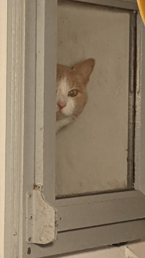
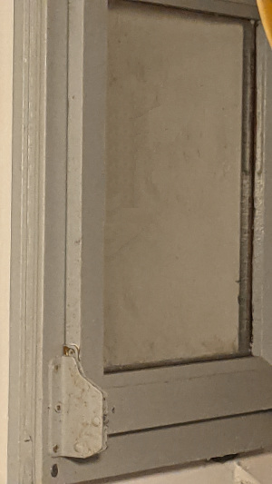
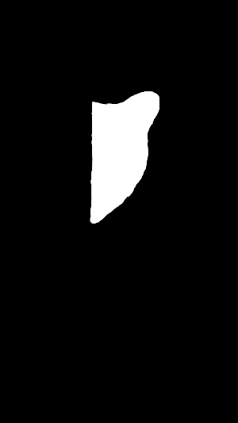
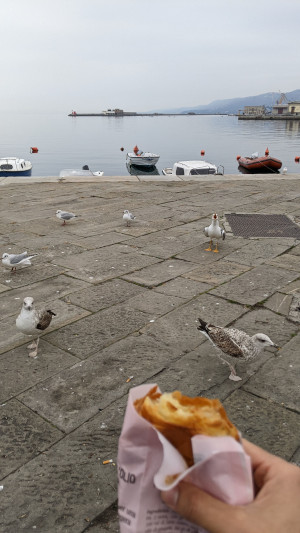
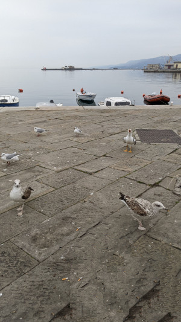
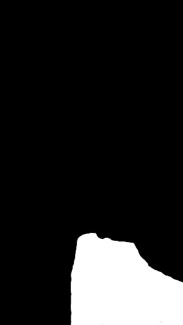
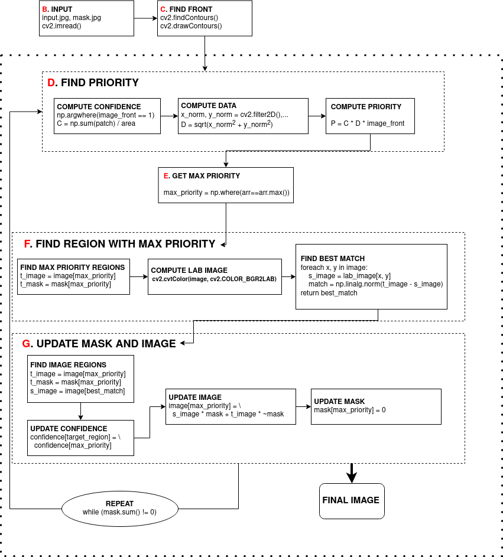

# Image Eraser

This tool allows removing objects from images following the algorithm described in the paper [Region Filling and Object Removal by
Exemplar-Based Image Inpainting](https://www.irisa.fr/vista/Papers/2004_ip_criminisi.pdf). It takes two images as an input, the source image and a mask image, and runs the pipeline to inpaint the masked region in the input image.

# Usage

First install all the requirements with:

```
pip install -r requirements.txt
```

The pipeline can then be run with the `main.py` script:

```
python main.py
```

> Note: This tool is resource intensive! It can take hours of magnitude to finish based on the input image and mask.


## Results

Below are some results obtained from using this tool.

<p align="center">
	
	
	
</p>

<p align="center">
	
	
	
</p>


## Project overview

This project implements the [Region Filling and Object Removal by
Exemplar-Based Image Inpainting](https://www.irisa.fr/vista/Papers/2004_ip_criminisi.pdf) paper by Criminisi et. al. It involves these stages.

<p align="center">
	
</p>

1. <b>Finding the image front</b>: To find the image front I found contours in my input mask and drew a boundary around them.
2. **Compute the pixel priorities:** This required computing each pixel's confidence and priority.
    1. **Calculating the pixel confidence:** The confidence vector was found by going through all the contour locations, summing up all these values, and dividing them by the patch area.
    2. **Computing the data values:** Computing the data values first required finding the normal vector. To compute this vector I first convolved my mask image with an edge detection kernel. I computed the normal along the x- and y-axis by transposing my original kernel.
This implementation finds the normal along both axes in a combined manner, which makes the code more efficient.
    3. **Combining the confidence and data to compute priorities:** As the final step I multiplied my confidence and data terms, along with the image front to get my final priorities.

3. **Find the maximum priority:** This step was simple, as it required finding the indices which contained the highest value in our priority vector.

4. **Finding the best matching region:**
    1. **Computing the target mask and image:** To get this I used a similar approach when calculating the image confidence, i.e. to get a boundary around the pixels based on my patch size.
    2. **Convert the color-space of my input image to CIE LAB:**
According to the paper this color space has a property called "perceptual uniformity", which means the Euclidean distances in this format are more precise compared to other color representations.
    3. **Iterate through the image pixels and find the best matching region:** This step is the most computationally expensive as it requires going through all image patches and computing the Euclidean distance between the source and target image patch. The target image patch was the region which had the highest priority. The source patch was computed at every iteration as the region surrounded by the current x and y values. At the end I returned the indices of the source path which gave the
best result.
5. **Copy the image data from source to target:** This was the final step of my algorithm. In this step I took the source and target patch indices from my previous step and found image pixels at those locations. The end result was the addition of my
source and target image patch.
6. **Run this until all our mask is filled in:** To compute this I take the sum of my mask. Once all the mask is filled in, it will be enitrely black, i.e. the sum will be zero. This is my cue to stop the algorithm.

## Requirements

This project was developed in Python 3.10. You must have the following depenedencies installed:

- OpenCV
- NumPy
